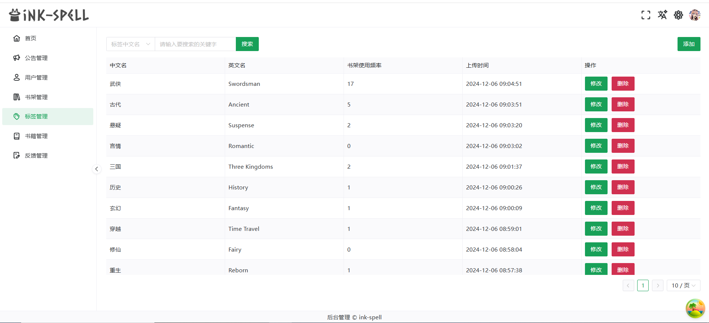
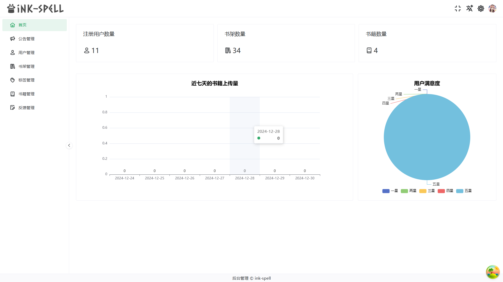

## ink-spell

> 🌀 一个收藏的魔法网站

## Project Directory Structure

**apps**

- client: Front-end client application based on React and Vite.
- admin: Front-end admin application based on Vue and Vite.
- server: Back-end server based on Next.js.

## function

- [x] Collect books
- [x] Grouped books
- [x] Search books
- [x] Read books
- [x] Share books
- [x] Move bookShelf
- [x] BookShelf management
- [x] follow user
- [x] ChatRoom
- [x] myFriend
- [x] Forgot Password via Email
- [x] Internationalization
- [x] Dark Mode
- [x] emoji
- [x] github login

## design sketch

**client**

**admin**

## License

[MIT](/LICENSE) License &copy; 2024 ink-spell
